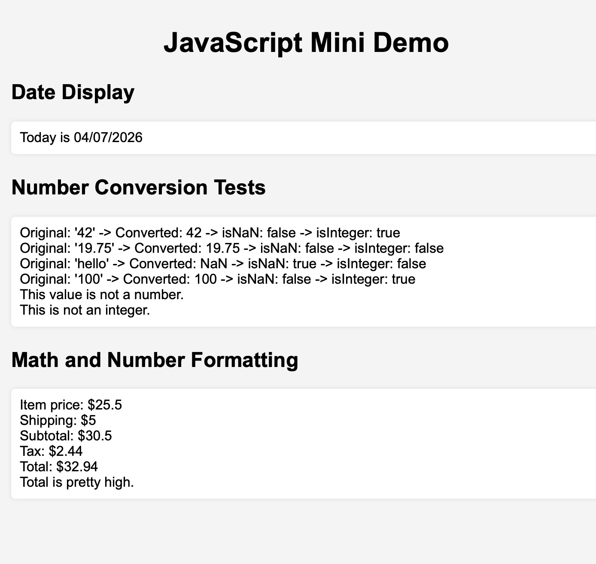

# JavaScript Mini Demo

## Built-in Objects I Used

- Date()
- Number()
- Number.isNaN()
- Number.isInteger()
- toFixed()

## GitHub Pages Link

https://patrickbaboop.github.io/homework9/

## Screenshot

## Reflection

The easiest part for me was the math section because it was just basic calculations.  
The hardest part was formatting the date correctly and remembering that months start at 0.  
I learned that the Date object needs adjustments like adding 1 to the month.  
I also learned that Number() can convert strings and sometimes returns NaN.  
I learned how to display results on the webpage using JavaScript instead of just console.log.